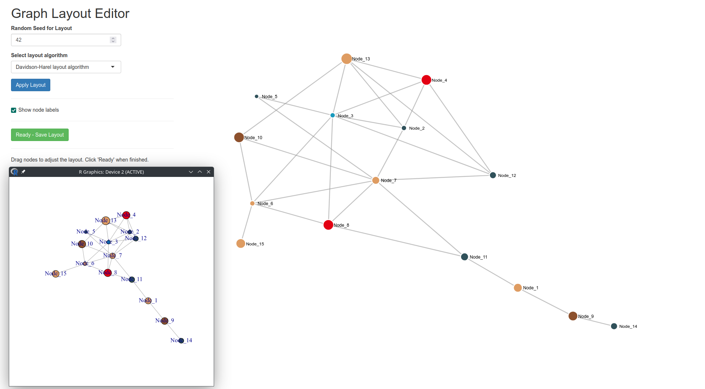

# igraphlayout: Interactive Graph Layout Editor

<!-- badges: start -->
[](https://lifecycle.r-lib.org/articles/stages.html#stable)
[](https://CRAN.R-project.org/package=igraphlayout)
[](https://github.com/pachadotdev/igraphlayout/actions/workflows/test-coverage.yaml)
[](https://buymeacoffee.com/pacha)
<!-- badges: end -->

An R Shiny application for editing graph layouts interactively using D3.js.

I found that using Cytoscape was not so simply as I needed to export a graph object to a file, open it in Cytoscape,
adjust the layout, export the coordinates, and then re-import them back into R. This package provides a more streamlined
way to interactively edit graph layouts visually and directly within R.

## How it Works

1. Choose from various igraph layout algorithms as a start.
2. Move nodes around with your mouse to create custom layouts.
3. Click "Ready" to save node coordinates back to the graph object.

## Installation

```r
install.packages("igraphlayout", repos = "https://pachadotdev.r-universe.dev/")

# or

remotes::install_github("pachadotdev/igraphlayout")
```

## Usage

```r
load_all()

library(igraph)

set.seed(42)
g <- sample_gnp(15, 0.2)

V(g)$name <- paste0("Node_", 1:vcount(g))
V(g)$color <- sample(tintin::tintin_clrs(), vcount(g), replace = TRUE)
V(g)$size <- sample(5:15, vcount(g), replace = TRUE)

layout_coords <- layout_with_kk(g)
V(g)$x <- layout_coords[, 1]
V(g)$y <- layout_coords[, 2]

plot(g, layout = layout_coords)

g2 <- edit_layout(g) # Launches the interactive layout editor

plot(g2, layout = cbind(V(g2)$x, V(g2)$y))
```

Here is the editor in action:


